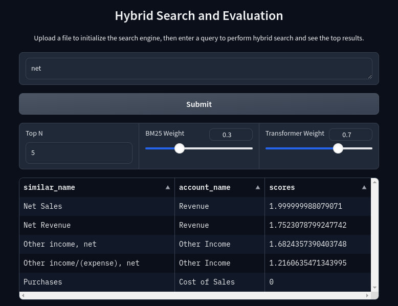

# Hybrid Search

## Overview
This project implements a solution for mapping various account names from multiple columns to preferred account names using a combination of traditional and advanced search techniques. The hybrid approach ensures accurate and efficient mapping by integrating keyword search with BM25 and similarity search with Sentence Transformers using FAISS.

### Interface Screenshot


## Problem Statement
The primary goal is to create an accurate and efficient mapping of account names using a hybrid search mechanism that combines BM25 and Sentence Transformers with FAISS. The project addresses the challenge of handling unmapped account names by leveraging advanced search techniques.

## Features
- **Initial Mapping**: Use a dictionary table to map account names from multiple columns to preferred account names.
- **Traditional Search**: Implement keyword search to retrieve account names based on the initial mapping.
- **Hybrid Search**: Combine BM25 and Sentence Transformers for improved accuracy in handling unmapped account names.
- **Evaluation**: Assess the search accuracy using confusion matrix and various metrics.
## Installation
1. Clone the repository:
    ```bash
    git clone https://github.com/nunenuh/hybrid-search.git
    cd hybrid-search
    ```
2. Set up a virtual environment:
    ```bash
    python3 -m venv .venv
    source .venv/bin/activate  # On Windows use `.venv\Scripts\activate`
    ```
3. Install dependencies:
    ```bash
    pip install -r requirements/main.txt
    ```

## Usage
1. Activate the environment
    ```bash
    source .venv/bin/activate  # On Windows use `.venv\Scripts\activate`
    ```
2. Run the Gradio interface:
    ```bash
    python run.py
    ```
3. Open your web browser with this url below
    ```
    http://127.0.0.1:7860
    ```
    It will show you this page:
    

2. Upload the Excel file to initialize the search engine.
    
3. Perform searches and view results.
4. Generate evaluation metrics to assess the accuracy and efficiency of the mapping solution.

## Project Structure
- `data/`: Directory for storing input data files.
- `src/`: Source code for the project.
  - `hybrid_search/`: Hybrid search modules.
    - `mapper.py`: Handles the dictionary mapping.
    - `search.py`: Implements the search functionalities.
    - `evaluation.py`: Evaluates the search performance.
- `run.py`: Main script to run the Gradio interface.
- `requirements/`: Directory for requirements files.
  - `main.txt`: Production dependencies.  
  - `dev.txt`: Development dependencies.
- `README.md`: Project overview and setup instructions.
- `setup.cfg`: Configuration file for the project.

## Evaluation
Generate evaluation metrics to assess the accuracy and efficiency of the mapping solution. This is the example from sample data provided.


## Documentation
Refer to the inline comments and function docstrings for detailed explanations of the code.