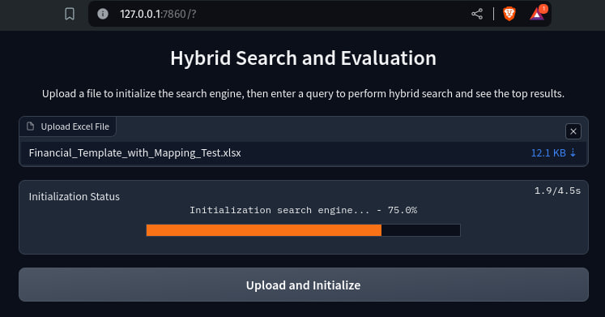

# Hybrid Search

## Overview
This project implements a solution for mapping various account names from multiple columns to preferred account names using a combination of traditional and advanced search techniques. The hybrid approach ensures accurate and efficient mapping by integrating keyword search with BM25 and similarity search with Sentence Transformers using FAISS.
<br/>

## Detailed Explanation & Justification
### Sentence Transformer with Pre-Trained Financial Model
The "uonyeka/bge-base-financial-matryoshka" model was chosen for its specific design for financial text, providing 768-dimensional dense vector space mappings ideal for semantic similarity tasks. Its understanding of financial terminology ensures more accurate and relevant search results, improving the hybrid search mechanism with precise semantic embeddings tailored to the financial domain.

### Search Embedding SBERT with FAISS  
FAISS is chosen as the embedding manager for its efficiency and scalability. It handles large datasets effectively, providing fast nearest neighbor search and clustering of dense vectors. This ensures quick and accurate search results even as the dataset grows, maintaining performance in real-world applications with significant data volumes.

### BM25 Search
BM25 is chosen for its effectiveness in keyword-based search, considering term frequency, inverse document frequency, and document length. It provides balanced and relevant ranking of search results, enhancing the hybrid search system by leveraging both term-based and semantic similarities for accurate mapping results.
### Reciprocal Rank Fusion (RRF)
Reciprocal Rank Fusion (RRF) is a rank aggregation method that combines the results from different ranking algorithms. The RRF score is calculated by taking the sum of the reciprocal of the ranks provided by each ranking algorithm, which penalizes lower-ranked documents. The formula for RRF is given by:

$$RRF(d) = \sum_{i=1}^N \frac{w_i}{k + r_i(d)}$$

where:
- ${r_i(d)}$ is the rank of document ${d}$ in the ${i}$-th ranked list.
- ${w_i}$ is the weight of the ${i}$-th ranked list.
- ${k}$ is a constant (usually set to 60).

This formula ensures that documents ranked highly by multiple algorithms receive a higher combined score, thereby improving the accuracy of the final ranked list.

### Hybrid Search Implementation
The hybrid search method combines BM25 and transformer-based search using weighted RRF to ensure balanced and accurate ranking results.

This code below is the part of class HybridSearch with method hybrid_search. The flow is search with sentence transformer, search with bm25, get the RRF score, get combined indices, scores and candidate that will be used to show the result.
```python
  def hybrid_search(
      self,
      query: str,
      top_n: int = 10,
      transformer_weight: float = 0.9,
      bm25_weight: float = 0.3,
  ) -> List[dict]:
      """
      Performs hybrid search combining BM25 and transformer-based search using weighted RRF.

      Args:
          query (str): Query string.
          top_n (int): Number of top results to return.
          transformer_weight (float): Weight for transformer scores.
          bm25_weight (float): Weight for BM25 scores.

      Returns:
          list: Ranked results from hybrid search.
      """
      # sentence transformer search
      query_embedding = self._query_embedding(query)
      tfr_indices, tfr_scores = self.fmgr.search(query_embedding, top_n=top_n)

      # bm25 search
      tokenized_query = self._tokenize(query)
      bm25_scores = self.bm25.get_scores(tokenized_query)
      bm25_indices = np.argsort(bm25_scores)[::-1][:top_n]

      # get RRF scores by use both indice from bm25 and sber and the weight
      rankings = [tfr_indices.tolist(), bm25_indices.tolist()]
      weights = [transformer_weight, bm25_weight]
      rrf_scores = self._rrf(rankings, weights)

      # Extract combined indice and scores to get candidates
      combined_indices = list(rrf_scores.keys())
      combined_scores = [rrf_scores[doc_id] for doc_id in combined_indices]
      combined_candidates = [self.corpus[doc_id] for doc_id in combined_indices]

      ranked_results = self._ranked_result(combined_candidates, combined_scores)

      return ranked_results
```

And this code below is the part of the rrf algorithm from HybridClass
```python
  def _rrf(
      self, rankings: List[List[int]], weights: List[float], k: int = 60
  ) -> dict:
      """
      Calculates the Reciprocal Rank Fusion (RRF) score with weights.

      Args:
          rankings (list of list of int): Rankings from different methods.
          weights (list of float): Weights for each ranking method.
          k (int): The constant for RRF.

      Returns:
          dict: Combined ranking scores.
      """
      rrf_scores = {}
      for weight, rank_list in zip(weights, rankings):
          for rank, doc_id in enumerate(rank_list):
              rrf_scores[doc_id] = rrf_scores.get(doc_id, 0) + weight / (k + rank + 1)
      return rrf_scores
```

## Problem Statement
The primary goal is to create an accurate and efficient mapping of account names using a hybrid search mechanism that combines BM25 and Sentence Transformers with FAISS. The project addresses the challenge of handling unmapped account names by leveraging advanced search techniques.

## Features
- **Initial Mapping**: Use a dictionary table to map account names from multiple columns to preferred account names.
- **Traditional Search**: Implement keyword search to retrieve account names based on the initial mapping.
- **Hybrid Search**: Combine BM25 and Sentence Transformers for improved accuracy in handling unmapped account names.
- **Evaluation**: Assess the search accuracy using confusion matrix and various metrics.
## Installation
1. Clone the repository:
    ```bash
    git clone https://github.com/nunenuh/hybrid-search.git
    cd hybrid-search
    ```
2. Set up a virtual environment:
    ```bash
    python3 -m venv .venv
    source .venv/bin/activate  # On Windows use `.venv\Scripts\activate`
    ```
3. Install dependencies:
    ```bash
    pip install -r requirements/main.txt
    ```

## Usage
1. Activate the environment
    ```bash
    source .venv/bin/activate  # On Windows use `.venv\Scripts\activate`
    ```
2. Run the Gradio interface:
    ```bash
    python run.py
    ```
3. Open your web browser with this url below
    ```
    http://127.0.0.1:7860
    ```
    It will show you this page:
    

2. Upload the Excel file to initialize the search engine.
    
3. Perform searches and view results.
4. Generate evaluation metrics to assess the accuracy and efficiency of the mapping solution.

## Project Structure
- `data/`: Directory for storing input data files.
- `src/`: Source code for the project.
  - `hybrid_search/`: Hybrid search modules.
    - `mapper.py`: Handles the dictionary mapping.
    - `search.py`: Implements the search functionalities.
    - `evaluation.py`: Evaluates the search performance.
- `run.py`: Main script to run the Gradio interface.
- `requirements/`: Directory for requirements files.
  - `main.txt`: Production dependencies.  
  - `dev.txt`: Development dependencies.
- `README.md`: Project overview and setup instructions.
- `setup.cfg`: Configuration file for the project.


## Evaluation
Generate evaluation metrics to assess the accuracy and efficiency of the mapping solution. This is picture below is a test with H,I,J column from data provided in excel. The base mapping is using F and G column relative to C column, the base mapping is a corpus and a map for known data, and H,I,J is for test mapping or not knowing mapping.


### Data Preparation and Mapping
* **Reference Column**: Column C, Acts as the base reference for all mappings. This column contains the preferred account names.

* **Base Mapping**: Column F and G, Contain known data mappings to Column C. These columns are used to create the initial dictionary table for account name mapping.

* **Test Mapping**: Column H, I, and J, These columns contain data for testing the accuracy of the mappings against Column C. They are used to validate the mapping solution by comparing their mappings to the reference in Column C.

  #### Example Data in The Column
  * Column C (Reference): Preferred Account Names (e.g., "Revenue", "Cost of Sales").
  * Column F (Base Mapping 1): Account names that should map to the values in Column C (e.g., "Turnover" -> "Revenue").
  * Column G (Base Mapping 2): Another set of account names mapping to Column C (e.g., "Sales" -> "Revenue").
  * Column H (Test Mapping 1): New account names for testing (e.g., "Income" -> "Revenue").
  * Column I (Test Mapping 2): Additional test account names (e.g., "Expenses" -> "Cost of Sales").
  * Column J (Test Mapping 3): Further test account names (e.g., "Operational Cost" -> "Cost of Sales").

### Evaluation Process

1. Generate Labels:

    Extract true and predicted labels from the test mapping using the hybrid search method.
    ```python
    true_labels, predicted_labels = generate_labels(
      test_mapping,
      engine.hybrid_search
    )
    ```
2. Calculate Evaluation Metrics:

    Generate confusion matrix and metrics such as precision, recall, F1 score, and accuracy.
    ```python
    precision, recall, f1, accuracy = calculate_evaluation_metrics(true_labels, predicted_labels)
    tp, fp, fn, tn, labels = calculate_confusion_metrics(true_labels, predicted_labels)
    ```
3. Output Evaluation Metrics:

    Display metrics in a readable format.
    ```python
    evaluation_df = pd.DataFrame(
        {
            "Metric": ["True Positive", "False Positive", "False Negative", "True Negative", "Precision", "Recall", "F1 Score", "Accuracy"],
            "Value": [tp.sum(), fp.sum(), fn.sum(), tn.sum(), precision, recall, f1, accuracy],
        }
    )
    ```


## Documentation
Refer to the inline comments and function docstrings for detailed explanations of the code.

## What Next?
To further enhance the mapping process, consider the following top recommendations:

  **1. Train a Domain-Specific Model**:
  Fine-tune the Sentence BERT model using a dataset specific to the financial domain. If no dataset is available, generate one using ChatGPT with prompt engineering to improve semantic understanding and mapping accuracy.

  **2. Dynamic Weight Adjustment**:
    Develop a mechanism to dynamically adjust BM25 and transformer weights based on query type or performance data. This approach can optimize the balance between keyword relevance and semantic similarity, enhancing overall search accuracy.

  **3. Active Learning**:
  Implement active learning to allow the model to query experts for uncertain mappings. This iterative approach leverages expert feedback to continuously refine the model, improving accuracy over time.

## Reference
* bm25 github: https://github.com/dorianbrown/rank_bm25
* bm25 paper: http://www.cs.otago.ac.nz/homepages/andrew/papers/2014-2.pdf
* sbert model: https://huggingface.co/uonyeka/bge-base-financial-matryoshka
* RRF Explanation: https://weaviate.io/blog/hybrid-search-explained
* RRF Paper : https://www.semanticscholar.org/paper/Risk-Reward-Trade-offs-in-Rank-Fusion-Benham/26bcfffe1740d3fd8c88e60760e139d1f489af99

* FAISS: https://github.com/facebookresearch/faiss
## Citation
### Sentence Transformer
    @inproceedings{reimers-2019-sentence-bert,
        title = "Sentence-BERT: Sentence Embeddings using Siamese BERT-Networks",
        author = "Reimers, Nils and Gurevych, Iryna",
        booktitle = "Proceedings of the 2019 Conference on Empirical Methods in Natural Language Processing",
        month = "11",
        year = "2019",
        publisher = "Association for Computational Linguistics",
        url = "https://arxiv.org/abs/1908.10084",
    }
### MatryoshkaLoss
    @misc{kusupati2024matryoshka,
        title={Matryoshka Representation Learning},
        author={Aditya Kusupati and Gantavya Bhatt and Aniket Rege and Matthew Wallingford and Aditya Sinha and Vivek Ramanujan and William Howard-Snyder and Kaifeng Chen and Sham Kakade and Prateek Jain and Ali Farhadi},
        year={2024},
        eprint={2205.13147},
        archivePrefix={arXiv},
        primaryClass={cs.LG}
    }

### MultipleNegativesRankingLoss
    @misc{henderson2017efficient,
        title={Efficient Natural Language Response Suggestion for Smart Reply},
        author={Matthew Henderson and Rami Al-Rfou and Brian Strope and Yun-hsuan Sung and Laszlo Lukacs and Ruiqi Guo and Sanjiv Kumar and Balint Miklos and Ray Kurzweil},
        year={2017},
        eprint={1705.00652},
        archivePrefix={arXiv},
        primaryClass={cs.CL}
    }

### RRF
    @misc{benham2017risk,
        title={Risk-Reward Trade-offs in Rank Fusion},
        author={Rodger Benham and Alistair Moffat and Falk Scholer and Paul Thomas and Andrew Turpin},
        year={2017},
        url={https://dl.acm.org/doi/10.1145/3166072.3166084}
    }

### FAISS
    @misc{faiss,
      author = {Johnson, Jeff and Douze, Matthijs and Jégou, Hervé},
      title = {{FAISS}: A library for efficient similarity search and clustering of dense vectors},
      year = {2017},
      publisher = {GitHub},
      journal = {GitHub repository},
      howpublished = {\url{https://github.com/facebookresearch/faiss}}
    }
